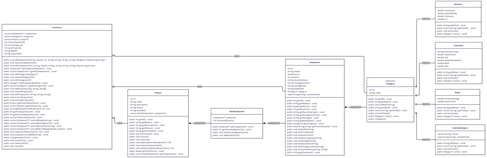

# The Vault.HW

[](https://en.wikipedia.org/wiki/C%2B%2B17)
[](https://cmake.org/)
[](https://opensource.org/licenses/MIT)

**The Vault.HW** is a **CLI-based** hardware inventory management system designed for **organizing and tracking** electronic **components** across personal **projects**.  
It allows users to manage components, categories, and projects, monitor **stock availability**, allocate parts to active builds, **compare component specifications**, and generate project component **reports** — all through a fast and efficient console interface. 
---

## Features

- **Component Inventory** — Add, edit, view, and remove electronic components with fields for model, quantity, price, storage location, mounting type, package, and datasheet.
- **Category System** — Three built-in component categories (Resistor, Transistor, Diode) with type-specific technical fields, plus the ability to define fully custom categories with user-chosen fields and measurement units.
- **Project Management** — Create and manage projects, each holding a list of components required for that build.
- **Component Allocation** — Assign specific quantities of components to a project. Allocated stock is tracked separately from the total inventory and returned when the allocation is removed.
- **Active and Archived Projects** — Projects can be archived at any time. Archived projects no longer affect inventory levels but remain accessible for reference.
- **Stock Distribution** — View a breakdown of how a component's stock is distributed across all projects, alongside the remaining free quantity.
- **Component Search** — Search components by name, category, or storage location, with an optional price range filter.
- **Component Comparison** — Compare any two components side by side across all their fields.
- **BOM Export** — Generate a `.txt` Bill of Materials for any project, listing all components with quantities, prices, and a total cost.


---

## Repository Structure

```
The-Vault-HW/
├── docs/       
├── app/
│   ├── include/
│   ├── src/    
│   ├── db/     
│   ├── exports/
│   ├── build/  
│   └── CMakeLists.txt
├── .gitignore
├── LICENSE
└── README.md
```
 
---

## Class Diagram


 
---

## Build Instructions

### Prerequisites

- **CMake 4.3** or higher
- **A C++17**-compatible compiler (GCC, Clang, or MSVC)
### Build and Run

```bash
# Navigate to the app directory
cd app
 
# Create the build directory
mkdir build

#Navigate to the build directory
cd build

# Generate build files (in build/)
cmake ..
 
# Compile only (in build/)
cmake --build .
 
# Compile & build (in build/)
cmake --build . --target run 


```

### Navigation

The application uses an arrow-key driven menu. Use the **Up** and **Down** arrow keys to move between options and press **Enter** to confirm a selection.

<p align="center">
  
  
  
</p>

---

## License

This project is licensed under the MIT License. See the [LICENSE](LICENSE) file for details.
 