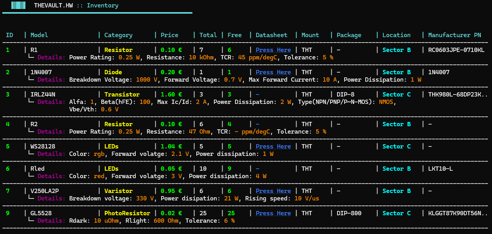
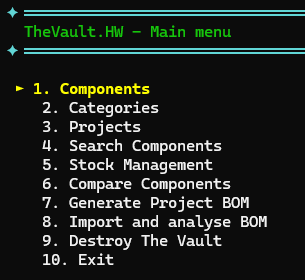
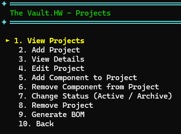
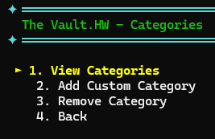

# The Vault.HW

[](https://en.wikipedia.org/wiki/C%2B%2B17)
[](https://cmake.org/)
[](https://opensource.org/licenses/MIT)


> The Vault.HW is a **CLI-based** hardware inventory management system designed for **organizing and tracking** electronic **components** across personal **projects**.  
It allows users to manage components, categories, and projects, monitor **stock availability**, allocate parts to active builds, **compare component specifications**, and import/export project **BOMs** — all through a fast and efficient console interface.
---

## Features

* **Component Inventory** — Add, edit, view, and remove electronic components with comprehensive fields including model, Manufacturer Part Number (MPN), quantity, price, storage location, mounting type, package, and datasheet link.
* **Category System** — Three built-in component categories (Resistor, Transistor, Diode) with type-specific technical fields. Ability to dynamically define fully custom categories with user-chosen properties and custom measurement units.
* **Project Management** — Create, manage, and toggle the status (Active/Archived) of projects. Archived projects act as historical records and immediately restore their allocated components back to the global free pool.
* **Component Allocation** — Assign precise quantities of components to active builds. Allocated stock is strictly isolated from the total unallocated (free) inventory.
* **Stock Monitoring & Override** — View a comprehensive breakdown of how a single component is distributed across all your projects. Includes the ability to manually override unallocated stock quantities at any time without disrupting active projects.
* **Component Comparison** — Interactive side-by-side comparison of any two components across both standard and category-specific technical specifications.
* **Component Search** — Look up components by name, category, or storage location, accompanied by a dynamic price range filter.
* **External BOM Analysis** — Import `.csv` Bill of Materials generated from EDA software like Altium Designer, KiCad and others. The software intelligently parses unpredictable headers, evaluates required quantities against the local database (matching by MPN), and generates a precise procurement shortage report.
* **BOM Export** — Export a `.txt` Bill of Materials for any local project, detailing part numbers, footprint/locations, quantities, unit prices, and total project cost.




---

### Navigation

The application uses an arrow-key driven menu. Use the **Up** and **Down** arrow keys to move between options and press **Enter** to confirm a selection.

<p align="center">
  
  
  
</p>

---

## Repository Structure

```
The-Vault-HW/
├── docs/       
├── app/
│   ├── include/
│   ├── src/    
│   ├── db/     
│   ├── exports/
│   ├── build/  
│   └── CMakeLists.txt
├── .gitignore
├── LICENSE
└── README.md
```

---

## Dependencies

The core requirements needed to compile the application are outlined below.

| Dependency | Required Version |
| :--- |:-----------------|
| **C++ Standard** | `C++17`          |
| **Compiler** | GCC `7.3+`       |
| **Build System** | CMake `4.3+`     |


---

## Build Instructions

First create this folders in **app/** directory:

```bash
# Used for build files
mkdir build

# Used for storingt the database files
mkdir db

# Used for exporting BOMs
mkdir exports
```

Now navigate to the **app/build/** directory and run the following commands to build and run the application:

```bash

# Generate build files 
cmake ..
 
# Compile only 
cmake --build .
 
# Compile & run the application
cmake --build . --target run 


```

---

## License

This project is licensed under the MIT License. See the [LICENSE](LICENSE) file for details.

